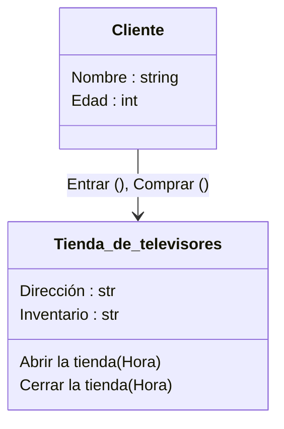
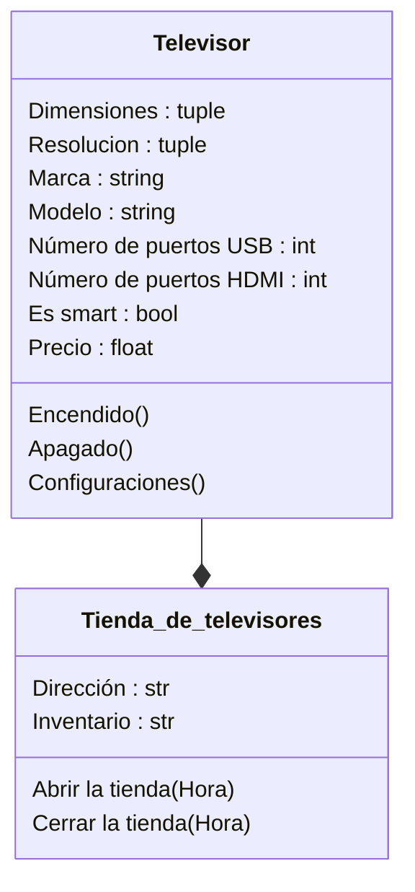
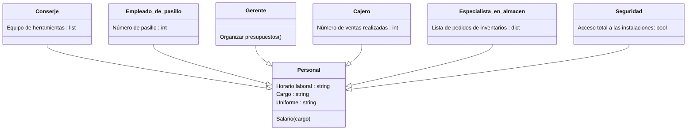
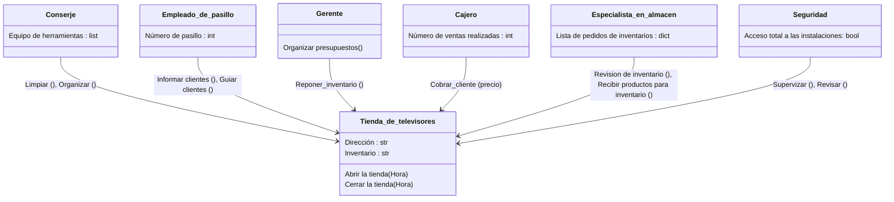

## Reto 2 - Modelado de un problema de la vida real a través de objetos y clases

El reto propuesto en clase fue el modelado de una situación de la vida real a través de relaciones entre objetos y clases, haciendo uso del conocimiento adquirido durante la sesión y diagramas tipo UML.
Como la situación a modelar era de libre elección opte por modelar a través de objetos y clases una tienda de televisores.

### Relación tienda de televisores - cliente

### Relación Tienda de televisores -  Televisor

### Relación entre el personal de la tienda

### Relación tienda de televisores - personal

